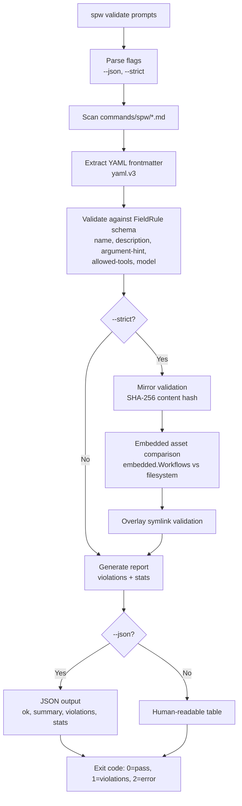
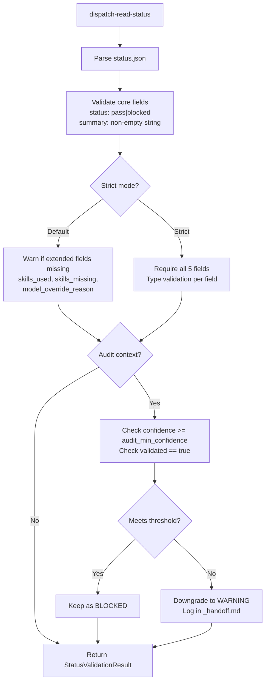
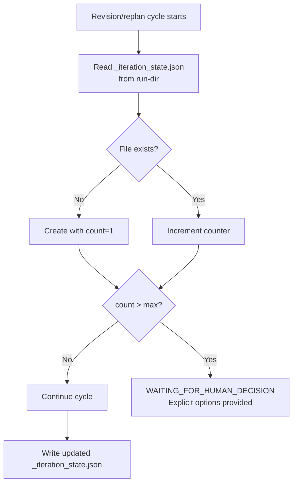

---
spw:
  schema: 1
  spec: "claude-code-based-improvements"
  doc: "design"
  status: "draft"
  source: "spw:design-draft"
  updated_at: "2026-02-13"
  inputs:
    - ".spec-workflow/specs/claude-code-based-improvements/requirements.md"
    - ".spec-workflow/specs/claude-code-based-improvements/design/DESIGN-RESEARCH.md"
  requirements:
    - "REQ-001"
    - "REQ-002"
    - "REQ-003"
    - "REQ-004"
    - "REQ-005"
    - "REQ-006"
    - "REQ-007"
  decisions:
    - "D-001: New validate package"
    - "D-002: yaml.v3 for frontmatter"
    - "D-003: Graduated status.json validation"
    - "D-004: Top-level validate command"
    - "D-005: Content-hash mirror comparison"
    - "D-006: Iteration state file"
  risk: "medium"
  open_questions: []
---

# Design Document

## Overview

- **Technical objective:** Move SPW validations and guardrails from prompt markdown into deterministic Go CLI commands, creating a `spw validate` command group and extending existing dispatch tools with full contract enforcement, confidence-based audit gating, and iteration limits.
- **Relationship to the product problem:** Critical workflow rules currently rely on prompt-based enforcement which is non-deterministic. By codifying validation in Go, SPW gains reproducible, testable, CI-compatible enforcement of frontmatter contracts, mirror integrity, status.json schemas, and audit quality thresholds.

## Requirement Mapping (Required)

| Requirement | Technical Decision | Components/Files | Test Strategy |
|---|---|---|---|
| REQ-001: Frontmatter validation | New `spw validate prompts` command. Schema-driven `[]FieldRule` validation with yaml.v3. Exit codes 0/1/2. JSON output via `--json`. | `cli/internal/validate/prompts.go`, `cli/internal/validate/schema.go`, `cli/internal/cli/validate_cmd.go` | Table-driven: valid file, missing each required field, invalid model, no frontmatter, empty file, extra fields. Golden file for JSON output. |
| REQ-002: Mirror validation | `--strict` flag on `spw validate prompts`. Phase 1: filesystem mirror diff via SHA-256 content hash. Phase 2: embedded asset comparison. Symlink target validation. | `cli/internal/validate/mirror.go` | Matching files, divergent content, missing mirror, extra files, broken symlinks. Embedded comparison. Integration on real repo. |
| REQ-003: status.json enforcement | Extend `DispatchReadStatus` with graduated validation. Default: 2 required + 3 optional (warn). Strict: all 5 required. | `cli/internal/validate/status.go`, `cli/internal/tools/dispatch_status.go` | All 5 present, missing optional (default=warn, strict=error), wrong types, invalid enum, null vs missing. |
| REQ-004: High-signal audit gate | New `[audit]` config section. `AuditConfig` struct. Gate: blocked + `confidence < threshold` becomes warning. | `cli/internal/config/config.go`, `cli/internal/validate/audit.go`, `cli/internal/tools/dispatch_status.go` | Boundary: exactly at 0.8, above, below. Downgrade behavior. Missing confidence field. |
| REQ-005: Iteration limits | `max_revision_attempts=3`, `max_replan_attempts=2` in `[execution]`. `_iteration_state.json` per run-dir. | `cli/internal/config/config.go`, `cli/internal/validate/iteration.go` | Counter increment, threshold trigger, state persistence, config override. |
| REQ-006: Doc updates | Checklist enforcement per implementation task. | `README.md`, `AGENTS.md`, `docs/SPW-WORKFLOW.md`, `hooks/README.md`, `copy-ready/README.md` | Manual checklist per task. |
| REQ-007: Regression tests | Table-driven Go tests per validator. Golden file tests for JSON stability. | `cli/internal/validate/*_test.go` | Minimum test matrix per validator. Integration smoke test on actual repository. |

## Considered Options and Trade-offs

### Option A: New `validate` package with top-level command (recommended)

- **Pros:** Clean separation of concerns. Discoverable CLI namespace (`spw validate`). Room for future subcommands (`spw validate docs`, `spw validate config`). Follows shellcheck/golangci-lint conventions.
- **Cons:** Adds a new top-level command to root. New package to maintain.
- **When not to use:** If the validate surface area remains trivially small (it will not, given 5+ validators).

### Option B: Validation logic inside existing `tools` package

- **Pros:** No new package. Reuses existing wiring.
- **Cons:** `tools` package already handles dispatch, config, and model resolution. Adding validation creates a kitchen-sink package. Less discoverable CLI path (`spw tools validate-prompts`).

### Frontmatter parser: yaml.v3 vs manual parser

- **yaml.v3 (chosen):** Handles YAML arrays natively for `allowed-tools: [Read, Grep, Bash]`. Type-safe struct unmarshalling. Small dependency (no transitive deps). Well-established in Go ecosystem.
- **Manual parser:** Zero deps but cannot parse arrays. Would require `allowed-tools` to be a comma-separated string, deviating from standard YAML.

### status.json validation: Graduated vs breaking

- **Graduated (chosen):** Default mode preserves backward compatibility with existing 2-field status.json files. Strict mode opt-in for full enforcement. Matches requirements ("no version bump needed").
- **Breaking:** Simpler code but invalidates all existing runs.

## Alignment with Steering Docs

### tech.md

- **Applied standards:** Go CLI with Cobra. Exit code convention (0/1/2). JSON output for CI integration. `BurntSushi/toml` for config parsing. Table-driven tests.

### structure.md

- **Applied organization conventions:** New package at `cli/internal/validate/` following existing structure (`cli/internal/hook/`, `cli/internal/tools/`, `cli/internal/config/`). Cobra command wiring in `cli/internal/cli/validate_cmd.go` following `hook.go`, `tools.go` patterns.

## Code Reuse

- **Modules/files to reuse:**
  - `cli/internal/tools/output.go` `Output()` function for JSON/plain formatting
  - `cli/internal/config/config.go` `Config` struct, `Defaults()`, `Load()`, `GetValue()` for config extension
  - `cli/internal/embedded/embed.go` `Workflows.ReadFile` and `AllWorkflowNames` for embedded asset validation
  - `cli/internal/registry/registry.go` as reference for frontmatter field patterns
  - `cli/internal/tools/dispatch_test.go` as test structure template
  - `scripts/validate-thin-orchestrator.sh` mirror logic to port to Go
- **Planned extensions:**
  - `AuditConfig` struct added to `Config` in `config.go`
  - `MaxRevisionAttempts` and `MaxReplanAttempts` fields added to `ExecutionConfig`
  - New `newValidateCmd()` registered in `root.go`
- **Code to avoid / critical legacy:**
  - Do not modify `parseKeyValue` in `registry.go` (different concern, different parsing context)
  - Do not break the existing `DispatchReadStatus` default behavior (2-field validation must remain the default)

## Architecture

### Boundaries

- **`cli/internal/validate/`**: All static validation logic. No runtime dispatch concerns. Pure functions that take paths/content and return validation results.
- **`cli/internal/cli/validate_cmd.go`**: Cobra command wiring only. Delegates to `validate` package.
- **`cli/internal/config/`**: Config struct extensions for `[audit]` and iteration limits. No validation logic here.
- **`cli/internal/tools/dispatch_status.go`**: Integration point for enhanced status.json validation and audit confidence gating. Calls into `validate` package.
- **Allowed dependencies:**
  - `validate` -> `config` (reads thresholds)
  - `validate` -> `embedded` (for `--strict` asset comparison)
  - `cli` -> `validate` (command wiring)
  - `tools` -> `validate` (dispatch_status uses status validation)
  - `validate` does NOT depend on `tools`, `hook`, or `cli`

### Main flow



### Status.json validation flow



### Iteration limit flow



## Contracts and Data Models

### Frontmatter FieldRule schema

```go
type FieldRule struct {
    Name     string   // field name in frontmatter
    Required bool     // whether field must be present
    Type     string   // "string", "string_array", "enum"
    Enum     []string // allowed values (for enum type)
}
```

Required fields for `commands/spw/*.md`:
- `name` (string, required)
- `description` (string, required)
- `argument-hint` (string, required)
- `allowed-tools` (string_array, required)
- `model` (enum: `["haiku", "sonnet", "opus"]`, required)

### Validation output JSON

```json
{
  "ok": true,
  "summary": "13 files checked, 2 violations found",
  "violations": [
    {
      "file": "commands/spw/exec.md",
      "field": "allowed-tools",
      "rule": "required",
      "message": "missing required field 'allowed-tools'"
    }
  ],
  "stats": {
    "files_checked": 13,
    "files_passed": 11,
    "files_failed": 2,
    "total_violations": 2
  }
}
```

### Enhanced status.json contract

```json
{
  "status": "pass",
  "summary": "Implementation complete with all tests passing",
  "skills_used": ["conventional-commits"],
  "skills_missing": [],
  "model_override_reason": null
}
```

Field types:
- `status`: enum `"pass"` | `"blocked"` (required)
- `summary`: non-empty string (required)
- `skills_used`: string array (extended, required in strict mode)
- `skills_missing`: string array (extended, required in strict mode)
- `model_override_reason`: string or null (extended, required in strict mode)

### Audit-extended status.json

```json
{
  "status": "blocked",
  "summary": "Potential logic error in wave resume",
  "confidence": 0.65,
  "validated": false,
  "skills_used": [],
  "skills_missing": [],
  "model_override_reason": null
}
```

Additional fields for audit subagents:
- `confidence`: float 0.0-1.0 (required for audit findings)
- `validated`: boolean (required for audit findings)

### AuditConfig

```toml
[audit]
audit_min_confidence = 0.8
```

```go
type AuditConfig struct {
    AuditMinConfidence float64 `toml:"audit_min_confidence"`
}
```

### Iteration state file

```json
{
  "revision_count": 2,
  "replan_count": 0,
  "last_updated": "2026-02-13T10:30:00Z"
}
```

### ExecutionConfig extensions

```go
type ExecutionConfig struct {
    // ... existing fields ...
    MaxRevisionAttempts int `toml:"max_revision_attempts"`
    MaxReplanAttempts   int `toml:"max_replan_attempts"`
}
```

Defaults: `max_revision_attempts=3`, `max_replan_attempts=2`.

## Error Strategy

- **Expected errors:**
  - Missing frontmatter fields: reported as violations with file path, field name, and rule. Exit code 1.
  - Mirror divergence: reported as divergent pairs with source and mirror paths. Exit code 1.
  - Invalid status.json: reported with field-level errors. `valid=false` in output.
  - Iteration limit exceeded: `WAITING_FOR_HUMAN_DECISION` status with explicit next-step options.
- **Unexpected errors:**
  - File read failures: wrapped with `fmt.Errorf("reading %s: %w", path, err)`. Exit code 2.
  - YAML parse failures: included in violations list (not a hard error for the batch).
  - Config load failures: fall back to defaults with warning.
- **Observability:**
  - All violations include: rule name, file path, field, human-readable reason.
  - `--json` output parseable by CI pipelines.
  - Downgraded audit findings logged in `_handoff.md` under `## Downgraded Findings`.
  - Iteration state changes logged with timestamp.

## Test Strategy

### Unit

- `cli/internal/validate/prompts_test.go`: Table-driven tests for each `FieldRule`. Valid frontmatter, each missing field, invalid enum values, malformed YAML, empty input, extra unknown fields.
- `cli/internal/validate/status_test.go`: All 5 fields present, missing optional (default vs strict), wrong types, invalid status enum, null vs missing distinction.
- `cli/internal/validate/audit_test.go`: Confidence boundary tests (exactly 0.8, 0.79, 0.81). Downgrade behavior. `validated=false` handling. Missing confidence field.
- `cli/internal/validate/mirror_test.go`: Matching content, divergent content, missing files, extra files, symlink targets.
- `cli/internal/validate/iteration_test.go`: Counter creation, increment, threshold trigger, state persistence, config override.

### Integration

- `cli/internal/validate/prompts_integration_test.go`: End-to-end `spw validate prompts` on the actual `commands/spw/*.md` directory. Verifies no regressions.
- Golden file tests for `--json` output format stability.
- Config loading integration: verify `[audit]` section parses correctly alongside existing sections.

### E2E/UAT

- Smoke test: `spw validate prompts` completes in under 2 seconds on the standard repository (NFR).
- Smoke test: `spw validate prompts --strict` detects intentional mirror divergence.
- Smoke test: `spw validate prompts --json` produces valid JSON.

## Risks and Mitigations

| Risk | Mitigation |
|---|---|
| Old status.json files break with strict validation | Default mode tolerates missing optional fields. Strict is opt-in only. |
| Wrong `allowed-tools` lists during frontmatter migration | Derive from workflow analysis. Include cross-check validation against actual workflow content. |
| Embedded asset path mapping errors | Define explicit mapping table in `mirror.go`. Test with actual embedded files. |
| Inconsistent audit confidence calibration | Document calibration guidelines with examples (syntax error=1.0, logic issue=0.7, style=0.4). Conservative default (0.8). Log all downgraded findings. |
| Iteration limits too aggressive for complex specs | Configurable defaults. `WAITING_FOR_HUMAN_DECISION` provides explicit escape hatch. |
| yaml.v3 dependency conflicts | No transitive dependencies. Pin version in `go.mod`. |
| `validate` package becomes a kitchen sink | Strict boundary: only static validation logic. No runtime dispatch, no hooks, no config mutations. |

## New Package Structure

```
cli/internal/
  validate/
    prompts.go           # Frontmatter validation logic
    prompts_test.go      # Tests for frontmatter validation
    mirror.go            # Mirror/embedded asset validation (--strict)
    mirror_test.go       # Tests for mirror validation
    status.go            # Enhanced status.json validation
    status_test.go       # Tests for status validation
    audit.go             # Audit confidence gate logic
    audit_test.go        # Tests for audit gate
    iteration.go         # Revision/replan counter logic
    iteration_test.go    # Tests for iteration limits
    schema.go            # Shared FieldRule types and helpers
  cli/
    validate_cmd.go      # Cobra command: spw validate prompts [--json] [--strict]
  config/
    config.go            # Extended: AuditConfig struct, ExecutionConfig fields
```

## Config Additions Summary

```toml
# New section
[audit]
audit_min_confidence = 0.8

# New fields in existing [execution] section
[execution]
max_revision_attempts = 3
max_replan_attempts = 2
```
