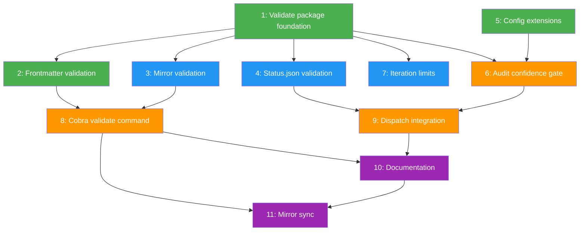

# Dependency Graph Builder Report: Wave 2

## Full Dependency DAG



Legend: Green = Wave 1 (complete), Blue = Wave 2 (current), Orange = Wave 3 (deferred), Purple = Wave 4 (deferred)

## ASCII DAG (fallback)

```
Wave 1 (COMPLETE)       Wave 2 (CURRENT)        Wave 3 (DEFERRED)       Wave 4 (DEFERRED)
─────────────────       ────────────────        ─────────────────       ─────────────────
[x] 1 ─────────────┬──> [ ] 3 ──────────────┬──> [ ] 8 ──────────┬──> [ ] 10 ──────> [ ] 11
     │              │                         │                    │         │              ^
     └──> [x] 2 ────│────────────────────────┘                    │         │              │
                     ├──> [ ] 4 ──────────────────> [ ] 9         │         └──────────────┘
                     │                                ^            │
                     └──> [ ] 7                       │            │
                                                      │            │
[x] 5 ──────────────────────────────> [ ] 6 ──────────┘            │
                                                                   │
                                                    8 ─────────────┘
```

## Wave 2 Dependency Validation

### Task 3 (Mirror validation)
- **Declared dependencies:** Task 1
- **Task 1 status:** COMPLETE (Wave 1)
- **Dependency satisfied:** YES
- **Inter-wave conflicts:** None. Creates new files `mirror.go`, `mirror_test.go` in `cli/internal/validate/`. No overlap with Tasks 4 or 7.

### Task 4 (Status.json validation)
- **Declared dependencies:** Task 1
- **Task 1 status:** COMPLETE (Wave 1)
- **Dependency satisfied:** YES
- **Inter-wave conflicts:** None. Creates new files `status.go`, `status_test.go` in `cli/internal/validate/`. No overlap with Tasks 3 or 7.

### Task 7 (Iteration limits)
- **Declared dependencies:** Task 1
- **Task 1 status:** COMPLETE (Wave 1)
- **Dependency satisfied:** YES
- **Inter-wave conflicts:** None. Creates new files `iteration.go`, `iteration_test.go` in `cli/internal/validate/`. No overlap with Tasks 3 or 4.

### Parallel Safety Verification

| Check | Result |
|-------|--------|
| All Wave 2 deps satisfied by Wave 1 | PASS |
| No inter-dependencies among 3, 4, 7 | PASS |
| No file conflicts (all create distinct files) | PASS |
| No shared mutable state | PASS |
| Fits max_wave_size=3 | PASS |
| All import only from `schema.go` types (no cross-imports) | PASS |

**Wave 2 grouping is VALID. All three tasks can execute in parallel.**

## Future Wave Readiness Analysis

### Wave 3 (Tasks 6, 8, 9) -- Ready after Wave 2

| Task | Dependencies | After Wave 2 Status |
|------|-------------|---------------------|
| 6 (Audit gate) | Tasks 1, 5 | All satisfied (Wave 1). **Note:** Task 6 does NOT depend on any Wave 2 tasks. It could theoretically have been in Wave 2, but it was correctly deferred since max_wave_size=3 is already filled by 3, 4, 7. |
| 8 (Cobra command) | Tasks 2, 3 | Task 2 complete (Wave 1), Task 3 completes in Wave 2. Satisfied after Wave 2. |
| 9 (Dispatch integration) | Tasks 4, 6 | Task 4 completes in Wave 2, Task 6 in Wave 3. **Task 9 cannot run until Task 6 completes.** |

**Wave 3 parallelism:** Tasks 6 and 8 can run in parallel (declared in tasks.md: `Can Run In Parallel With: 8` and `6` respectively). Task 9 must wait for Task 6. This means Wave 3 may need to be split:
- Wave 3a: Tasks 6, 8 (parallel)
- Wave 3b: Task 9 (after Task 6 completes)

Alternatively, all three could fit in a single wave if the orchestrator handles the internal dependency (6 -> 9) by sequencing Task 9 after Task 6 within the wave.

### Wave 4 (Tasks 10, 11) -- Ready after Wave 3

| Task | Dependencies | After Wave 3 Status |
|------|-------------|---------------------|
| 10 (Documentation) | Tasks 8, 9 | Both complete after Wave 3. Satisfied. |
| 11 (Mirror sync) | Tasks 8, 10 | Task 8 complete after Wave 3, Task 10 in Wave 4. **Task 11 must wait for Task 10.** |

**Wave 4 sequencing:** Tasks 10 and 11 are serial (10 -> 11). Cannot be parallelized. This is correct per tasks.md (both declare `Can Run In Parallel With: none`).

## Cycle Detection

**No cycles detected.** The dependency graph is a valid DAG. Topological sort produces:

1. Tasks 1, 5 (no dependencies -- Wave 1 roots)
2. Task 2 (depends on 1 -- Wave 1)
3. Tasks 3, 4, 7 (depend on 1 -- Wave 2)
4. Task 6 (depends on 1, 5 -- Wave 3)
5. Task 8 (depends on 2, 3 -- Wave 3)
6. Task 9 (depends on 4, 6 -- Wave 3, after 6)
7. Task 10 (depends on 8, 9 -- Wave 4)
8. Task 11 (depends on 8, 10 -- Wave 4, after 10)

## DAG Issues

**None found.** The dependency graph is consistent, acyclic, and correctly grouped. All parallel annotations in tasks.md match the actual dependency structure. No hidden dependencies or missing edges detected.

## Summary

Wave 2 (Tasks 3, 4, 7) is correctly grouped: all dependencies satisfied by completed Wave 1, no inter-dependencies, no file conflicts, fits within max_wave_size=3. The remaining DAG for Waves 3 and 4 remains valid with no broken chains. The only structural note is that Wave 3 contains an internal dependency (6 -> 9) and Wave 4 is serial (10 -> 11), which the future wave planner should account for.
