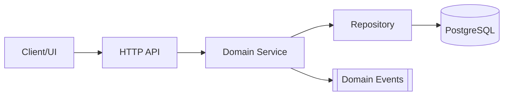
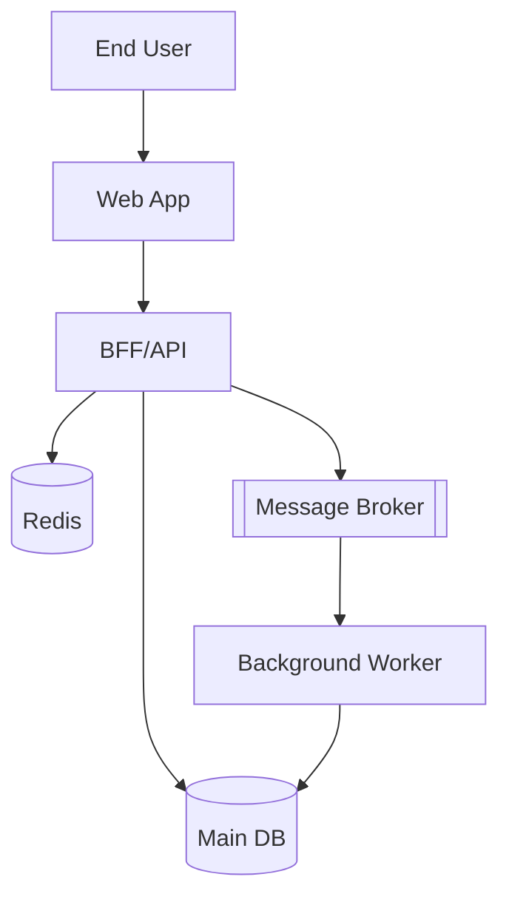
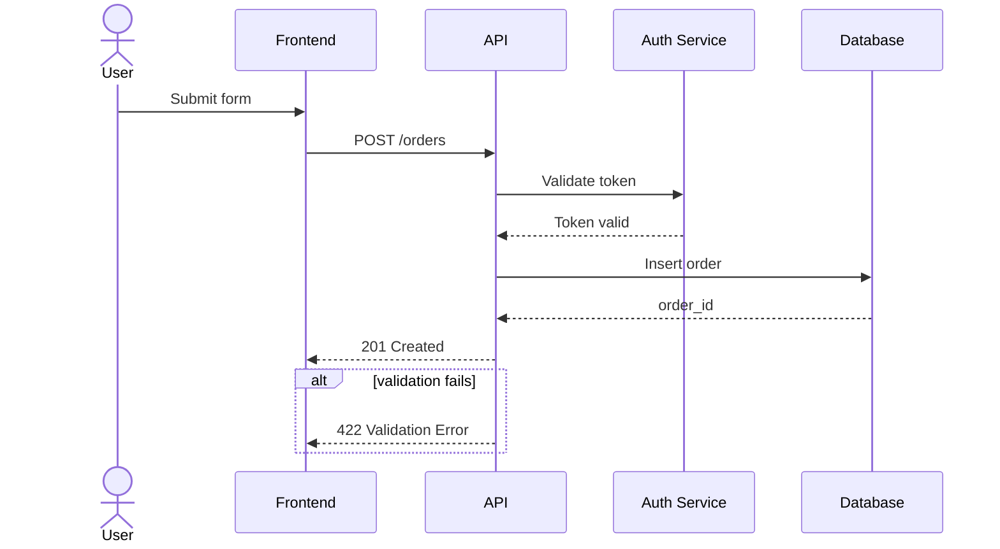
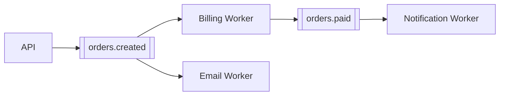
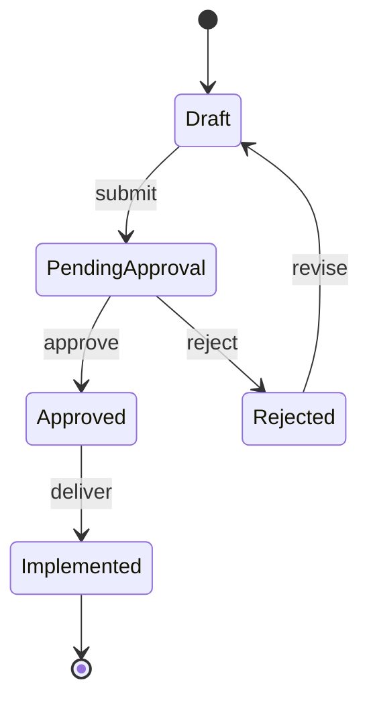

# Mermaid Architecture

Use this skill during design phases to transform architecture decisions into clear Mermaid diagrams that render reliably in `spec-workflow-mcp` dashboards.

## Output Contract

- Always use fenced code blocks: ```` ```mermaid ... ``` ````
- Prefer one focused diagram per section.
- Keep node IDs short and stable; keep labels descriptive.
- Use explicit direction (`flowchart TD` or `flowchart LR`).
- Avoid HTML/script/custom injections in labels.
- Keep labels consistent with terms used in `design.md`.

## Choose The Right Diagram

- Module/layer boundaries: `flowchart`
- Temporal request interaction: `sequenceDiagram`
- Async/event pipelines: `flowchart` with queue/topic nodes
- Workflow lifecycle: `stateDiagram-v2`
- Environment/deployment topology: `flowchart` grouped by environment

## Common Architecture Examples

### 1) Layered Architecture


### 2) C4-Style Container View


### 3) Request Sequence With Auth + Error Path


### 4) Event-Driven Processing Pipeline


### 5) State Machine For Approval/Delivery


## How To Apply In `design.md`

1. In `## Architecture`, include one main-flow diagram.
2. In `## Error Strategy` or `## Contracts`, include one focused sequence/state diagram for critical risk.
3. Make sure diagram edges/states map to requirement groups.
4. Update Mermaid when architectural decisions change.

## Quality Checklist

- Diagram renders in dashboard preview.
- Names in diagram match document terminology.
- Dependencies are real (no speculative edges).
- Critical error/retry behavior is explicit.
- No orphan component or state remains undocumented.
