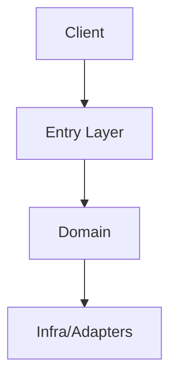

---
spw:
  schema: 1
  spec: "<spec-name>"
  doc: "design"
  status: "draft"
  source: "spw:design-draft"
  updated_at: "YYYY-MM-DD"
  inputs:
    - ".spec-workflow/specs/<spec-name>/requirements.md"
    - ".spec-workflow/specs/<spec-name>/design/DESIGN-RESEARCH.md"
  requirements: []
  decisions: []
  risk: "low"
  open_questions: []
---

# Design Document

## Overview
- Technical objective of the solution:
- Relationship to the product problem:

## Requirement Mapping (Required)
| Requirement | Technical Decision | Components/Files | Test Strategy |
|-------------|--------------------|------------------|---------------|
| REQ-001 | | | |
| REQ-002 | | | |

## Considered Options and Trade-offs
### Option A (recommended)
- Pros:
- Cons:
- When not to use:

### Option B
- Pros:
- Cons:

## Alignment with Steering Docs
### tech.md
- Applied standards:

### structure.md
- Applied organization conventions:

## Code Reuse
- Modules/files to reuse:
- Planned extensions:
- Code to avoid / critical legacy:

## Architecture
### Boundaries
- Contexts/modules:
- Allowed dependencies between modules:

### Main flow

## Contracts and Data Models
- Relevant entities and fields:
- API/event contracts:
- Migrations/schema (if applicable):

## Error Strategy
- Expected errors and handling:
- Unexpected errors and fallback:
- Observability (logs/metrics/traces):

## Test Strategy
### Unit
-

### Integration
-

### E2E/UAT
-

## Elixir/Phoenix/Ecto/OTP Guardrails (when applicable)
- Phoenix: avoid heavy queries in `mount`; prefer proper loading paths such as `handle_params` when relevant.
- Ecto: keep clear context boundaries; avoid improper cross-context coupling.
- OTP: do not introduce a GenServer without a runtime reason (state, concurrency, fault isolation).

## Risks and Mitigations
- Risk:
- Mitigation:
