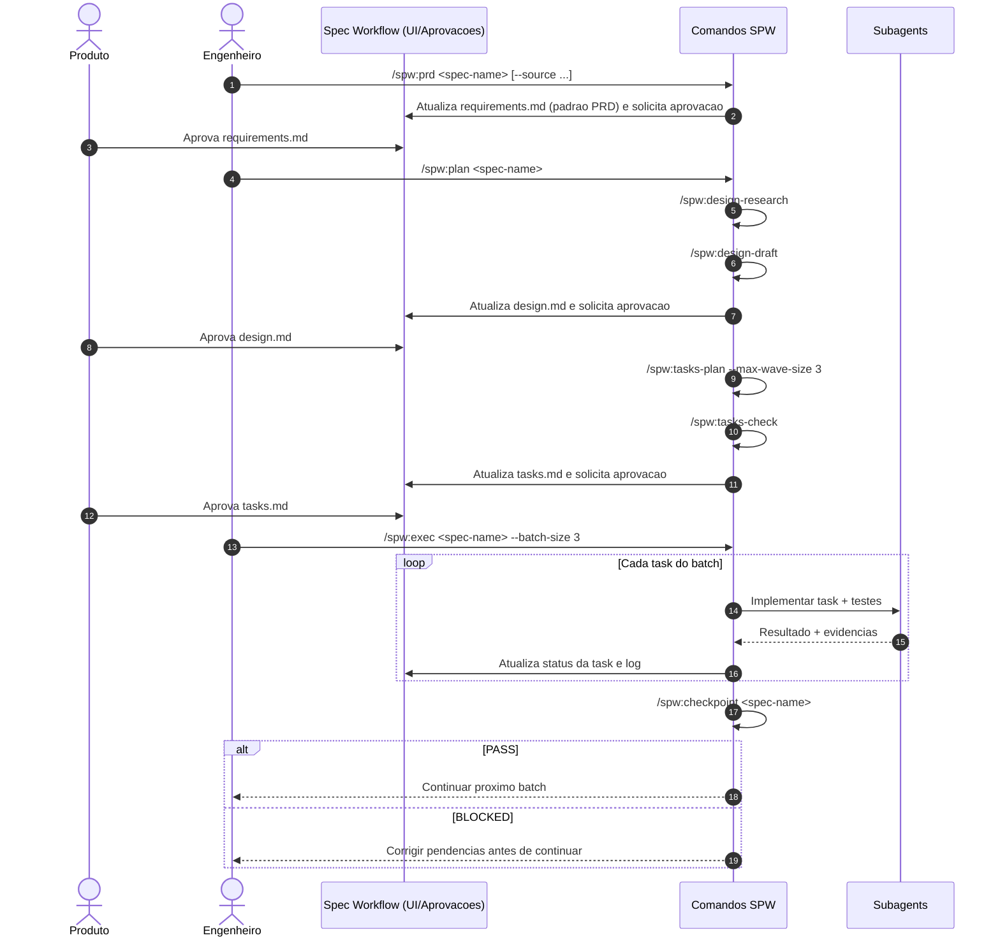

# SPW Workflow (spec-workflow + subagents)

Este pacote implementa o modelo discutido: usar o `spec-workflow-mcp` como fonte de verdade (UI + aprovações), com comandos de planejamento e execução mais rígidos para subagents.

## Objetivo

- Manter colaboração com produto em `requirements/design/tasks`.
- Aumentar previsibilidade de execução técnica.
- Garantir rastreabilidade `requirements -> design -> tasks -> código/testes`.
- Maximizar paralelismo por wave com segurança.

## Estrutura criada

- `spw/commands/spw/design-research.md`
- `spw/commands/spw/design-draft.md`
- `spw/commands/spw/prd.md`
- `spw/commands/spw/tasks-plan.md`
- `spw/commands/spw/tasks-check.md`
- `spw/commands/spw/plan.md`
- `spw/commands/spw/exec.md`
- `spw/commands/spw/checkpoint.md`
- `spw/templates/user-templates/prd-template.md`
- `spw/templates/user-templates/requirements-template.md`
- `spw/templates/user-templates/design-template.md`
- `spw/templates/user-templates/tasks-template.md`
- `spw/templates/user-templates/variants/tasks-template.tdd-on.md`
- `spw/templates/user-templates/variants/tasks-template.tdd-off.md`
- `spw/config/spw-config.toml`
- `spw/hooks/session-start-sync-tasks-template.sh`
- `spw/hooks/README.md`

## Como usar os templates

Copie os templates para o projeto que usa spec-workflow:

- `spw/templates/user-templates/requirements-template.md` -> `.spec-workflow/user-templates/requirements-template.md`
- `spw/templates/user-templates/prd-template.md` -> `.spec-workflow/user-templates/prd-template.md`
- `spw/templates/user-templates/design-template.md` -> `.spec-workflow/user-templates/design-template.md`
- `spw/templates/user-templates/tasks-template.md` -> `.spec-workflow/user-templates/tasks-template.md`

Observacao: no spec-workflow, custom template em `user-templates/` substitui integralmente o template padrao correspondente.

## Config e Hook (TDD por configuracao)

- Configure em `.spec-workflow/spw-config.toml`:
  - `execution.tdd_default = false|true`
  - `templates.tasks_template_mode = auto|on|off`
- O hook de SessionStart sincroniza automaticamente:
  - origem: `.spec-workflow/user-templates/variants/tasks-template.tdd-*.md`
  - destino: `.spec-workflow/user-templates/tasks-template.md`
- Com isso, voce nao precisa passar flag de TDD em comando; o comportamento vem da configuracao do projeto.

## Comandos e papeis

### 1) `spw:prd`
Gera `requirements.md` no formato PRD (mais aderente a produto), com descoberta guiada e gate para uso de MCP quando houver fonte externa (`--source`).
Use quando estiver com spec do zero (sem requirements aprovados).

### 2) `spw:design-research`
Pesquisa tecnica (codebase + web + guardrails Elixir/Phoenix/Ecto/OTP) e gera `DESIGN-RESEARCH.md`.

### 3) `spw:design-draft`
Consolida `requirements + research` em `design.md` com matriz de rastreabilidade por REQ-ID.

### 4) `spw:tasks-plan`
Gera `tasks.md` com:
- dependencias explicitas
- waves para paralelismo
- teste por tarefa (ou excecao justificada)

### 5) `spw:tasks-check`
Valida consistencia de `tasks.md` (rastreabilidade, ciclos, conflitos por wave, testes).

### 6) `spw:plan`
Orquestra pipeline completo:
`design-research -> design-draft -> tasks-plan -> tasks-check`.
Use quando `requirements.md` ja existir para a spec.
Antes de iniciar, valida aprovacao de requirements via MCP (`spec-status`) e solicita aprovacao (`request-approval`) se necessario.

## Escolha rapida de comando

- Sem `requirements.md`: use `spw:prd`.
- Com `requirements.md`: use `spw:plan` (ele valida/aprova via MCP antes de seguir).
- Regra de separacao: `spw:prd` define requisitos; `spw:plan` transforma requisitos em design/tasks.
- `spw:plan` nao confia so no arquivo: faz gate de aprovacao MCP antes de seguir.

### 7) `spw:exec`
Executa tasks em batches com subagents e pausa obrigatoria para checkpoint.

### 8) `spw:checkpoint`
Gate de qualidade entre batches/waves com relatorio PASS/BLOCKED.

## Sequencia de uso recomendada

## Modelo operacional (resumo)

1. Produto aprova artefatos no spec-workflow.
2. Planejamento tecnico gera design e tasks rastreaveis.
3. Execucao ocorre em lotes, com subagents e checkpoints obrigatorios.
4. Nenhuma wave avanca com checkpoint BLOCKED.

## Proximos passos

- Adaptar os comandos para o formato exato do seu runtime (Claude Code/Codex/OpenCode).
- Ajustar `max_tasks_per_wave` (3 ou 4) conforme perfil de risco do projeto.
- Incluir no pipeline uma checagem automatica de conflito de arquivos por wave (se quiser, eu monto isso no proximo passo).
