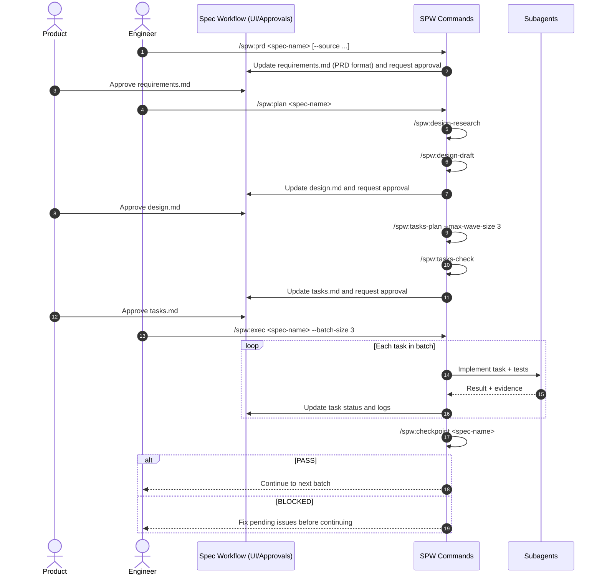

# SPW Workflow (spec-workflow + subagents)

This package implements the discussed model: use `spec-workflow-mcp` as the source of truth (UI + approvals), while adding stricter planning/execution commands for coding agents.

## Goals

- Keep product collaboration in `requirements/design/tasks`.
- Increase technical execution predictability.
- Enforce traceability `requirements -> design -> tasks -> code/tests`.
- Maximize safe parallelism per wave.

## Generated structure

- `spw/commands/spw/design-research.md`
- `spw/commands/spw/design-draft.md`
- `spw/commands/spw/prd.md`
- `spw/commands/spw/tasks-plan.md`
- `spw/commands/spw/tasks-check.md`
- `spw/commands/spw/plan.md`
- `spw/commands/spw/exec.md`
- `spw/commands/spw/checkpoint.md`
- `spw/commands/spw/status.md`
- `spw/commands/spw-teams/design-research.md`
- `spw/commands/spw-teams/tasks-check.md`
- `spw/commands/spw-teams/checkpoint.md`
- `spw/commands/spw-teams/exec.md`
- `spw/templates/user-templates/prd-template.md`
- `spw/templates/user-templates/requirements-template.md`
- `spw/templates/user-templates/design-template.md`
- `spw/templates/user-templates/tasks-template.md`
- `spw/templates/user-templates/variants/tasks-template.tdd-on.md`
- `spw/templates/user-templates/variants/tasks-template.tdd-off.md`
- `spw/config/spw-config.toml`
- `spw/bin/spw`
- `spw/scripts/install-spw-bin.sh`
- `spw/hooks/session-start-sync-tasks-template.sh`
- `spw/hooks/spw-statusline.js`
- `spw/hooks/spw-guard-user-prompt.js`
- `spw/hooks/spw-guard-paths.js`
- `spw/hooks/spw-guard-stop.js`
- `spw/hooks/spw-hook-lib.js`
- `spw/hooks/README.md`

## Artifact locality rule

All generated planning/research artifacts must stay inside the active spec folder:
- `.spec-workflow/specs/<spec-name>/`

Supporting research files (extra notes, references, examples) must stay in:
- `.spec-workflow/specs/<spec-name>/research/`

Do not generate research/planning files in generic locations such as `docs/`.

## How to use templates

Copy templates into the project using spec-workflow:

- `spw/templates/user-templates/requirements-template.md` -> `.spec-workflow/user-templates/requirements-template.md`
- `spw/templates/user-templates/prd-template.md` -> `.spec-workflow/user-templates/prd-template.md`
- `spw/templates/user-templates/design-template.md` -> `.spec-workflow/user-templates/design-template.md`
- `spw/templates/user-templates/tasks-template.md` -> `.spec-workflow/user-templates/tasks-template.md`

Note: in spec-workflow, a custom template in `user-templates/` fully overrides the matching default template.

## YAML frontmatter (spec docs)

Templates include optional YAML frontmatter under the `spw` key to help
subagents classify documents. This metadata does not replace MCP approvals or
status.

Fields used:
- `schema`, `spec`, `doc`, `status`, `source`, `updated_at`
- `inputs`, `requirements`, `decisions`, `task_ids`, `test_required`
- `risk`, `open_questions`

## Config and hook (TDD via config)

- Configure `.spec-workflow/spw-config.toml`:
  - `[models]` routing policy:
    - `web_research = haiku`
    - `complex_reasoning = opus`
    - `implementation = sonnet`
  - `execution.tdd_default = false|true`
  - `templates.tasks_template_mode = auto|on|off`
  - `hooks.enforcement_mode = warn|block`
  - `skills.*` sections for required/optional skills by phase
  - `skills.load_mode = subagent-first|principal-first`
  - per-stage enforcement booleans:
    - `skills.design.enforce_required = true|false`
    - `skills.implementation.enforce_required = true|false`
  - `[agent_teams]` (optional, disabled by default):
    - `enabled = false|true`
    - `teammate_mode = "in-process"|"tmux"`
    - `require_delegate_mode = true|false`
    - `max_teammates = <N>`
    - `use_for_phases = ["design-research","tasks-check","checkpoint","exec"]`
- SessionStart hook auto-syncs:
  - source: `.spec-workflow/user-templates/variants/tasks-template.tdd-*.md`
  - target: `.spec-workflow/user-templates/tasks-template.md`
- Statusline command (`spw-statusline.js`) shows:
  - model, project, git branch/dirty marker
  - active spec + phase + tasks progress (best effort)
  - scaled context usage bar
- With this setup, you do not need a TDD flag in command calls; behavior comes from project config.

Hook guard model:
- `warn` mode: report rule violations, continue execution
- `block` mode: deny violating action
- Guards enforce prompt completeness, artifact path rules, wave layout, and recent handoff completeness.

## Skills policy (config-driven)

SPW can load skills from `.spec-workflow/spw-config.toml`:
- `[skills]` (enable + legacy fallback enforcement)
- `[skills.design]` (design/planning stages)
- `[skills.implementation]` (execution/checkpoint stages)

Load strategy:
- `subagent-first` (default): main agent runs availability preflight only, and
  subagents load/apply skills per task/role.
- `principal-first` (legacy): main agent loads skills before dispatch.

Enforcement model:
- `enforce_required=true` -> stage is BLOCKED if any required skill is missing/not invoked.
- `enforce_required=false` -> warn and continue.
- Commands record per-stage skill loading evidence in spec artifacts (for example `SKILLS-DESIGN-DRAFT.md`, `SKILLS-EXEC.md`).

Default lists include Elixir-focused skills plus optional:
- `conventional-commits`
- `test-driven-development`
- `requesting-code-review`

`spw` attempts to copy these defaults into `.claude/skills/` from local skill directories when available.
Installer subcommands: `spw skills` installs only the default skills, and
`spw status` prints a quick kit/skills summary.
Wrapper commands: `spw update` refreshes the cached GitHub kit, and
`spw doctor` prints current wrapper repo/ref/cache settings.

## Subagent strategy (default)

- Use subagents as the default execution mode to keep main-session context small and deterministic.
- Model policy:
  - web-only scouting/search -> `haiku`
  - complex reasoning/synthesis/gates -> `opus`
  - implementation/drafting/execution -> `sonnet`
- Commands `spw:prd`, `spw:plan`, `spw:design-research`, `spw:design-draft`, `spw:tasks-plan`, `spw:tasks-check`, `spw:exec`, `spw:checkpoint`, and `spw:status` are all defined as subagent-driven workflows.

## Agent Teams (optional)

Agent Teams are experimental in Claude Code and disabled by default in SPW.
Enable them only when you want multi-agent collaboration with a shared task list.

Enablement:
- Set `[agent_teams].enabled = true` in `.spec-workflow/spw-config.toml`
- Add `env.CLAUDE_CODE_EXPERIMENTAL_AGENT_TEAMS = "1"` to `.claude/settings.json`
- Set `teammateMode = "in-process"` (change to `"tmux"` manually if desired)
- Use the team command pack (`commands/spw-teams/*.md`) instead of default command specs.
  - `spw install --enable-teams` applies this overlay automatically.
  - `spw install` (without `--enable-teams`) restores active commands to default `spw/*.md`.

Behavior:
- When enabled and the phase is listed in `[agent_teams].use_for_phases`, SPW creates a team.
- `spw:exec` enforces delegate mode when `[agent_teams].require_delegate_mode = true`.
- File-first handoff rules remain mandatory for every teammate.
- Reverting to default mode does not remove `spw-teams` files or existing teams keys from `.claude/settings.json`.

## File-first subagent communication (GSD-style)

For auditability and deterministic handoff, selected commands require file-based
subagent communication:
- `spw:design-research`
- `spw:prd` (including revision loops)
- `spw:tasks-plan`
- `spw:tasks-check`
- `spw:checkpoint`

Per run, commands create:
- `.spec-workflow/specs/<spec-name>/agent-comms/<command>/<run-id>/`

Wave-based execution/checkpoint communication uses:
- `.spec-workflow/specs/<spec-name>/agent-comms/waves/wave-<NN>/execution/<run-id>/`
- `.spec-workflow/specs/<spec-name>/agent-comms/waves/wave-<NN>/checkpoint/<run-id>/`
- optional: `.spec-workflow/specs/<spec-name>/agent-comms/waves/wave-<NN>/post-check/<run-id>/`
- plus wave-level files:
  - `.spec-workflow/specs/<spec-name>/agent-comms/waves/wave-<NN>/_wave-summary.md`
  - `.spec-workflow/specs/<spec-name>/agent-comms/waves/wave-<NN>/_latest.json`

Per subagent, required files:
- `<subagent>/brief.md` (orchestrator -> subagent contract)
- `<subagent>/report.md` (subagent result)
- `<subagent>/status.json` (`pass|blocked`, inputs/outputs/open questions)

Per command run:
- `<run-dir>/_handoff.md` (orchestrator synthesis and next-step context)

If required communication files are missing, the command must return BLOCKED.

## Subagent vs orchestrator responsibilities

All SPW lifecycle commands are subagent-driven:
- `spw:prd`
- `spw:plan`
- `spw:design-research`
- `spw:design-draft`
- `spw:tasks-plan`
- `spw:tasks-check`
- `spw:exec`
- `spw:checkpoint`
- `spw:status`

Non-subagent steps (orchestrator/gates) still exist and are expected:
- MCP approval checks and transitions (`spec-status`, `request-approval`, `get-approval-status`)
- Explicit user prompts (`AskUserQuestion`) for MCP source selection and wave continuation
- Execution stop states (`WAITING_FOR_APPROVAL`, `WAITING_FOR_USER_AUTHORIZATION`, `WAITING_FOR_HUMAN_ACTION`)
- Local hooks/install/runtime scripts (`spw`, statusline, template sync hook)

## Commands and roles (lifecycle order)

### 1) `spw:prd` (product requirements)
Generates `requirements.md` in PRD format (more product-oriented), with guided discovery and MCP-source gate when external input is provided (`--source`).
Use when starting from zero (no approved requirements).
When approval returns `changes-requested`/`rejected` (or `needs-revision`), `spw:prd` runs a revision protocol: feedback analysis + codebase impact scan + clarification questions before applying edits.
It only calls `request-approval` when no prior approval request/status exists.

### 2) `spw:plan` (technical planning orchestrator)
Runs the technical planning pipeline from existing requirements.
Use when `requirements.md` already exists for the spec.
Before starting, it validates requirements approval via MCP (`spec-status`) and requests approval (`request-approval`) when needed.
Approval is MCP-driven only: SPW commands do not ask for manual in-chat approval choices.
If requirements status is `needs-revision`/`changes-requested`/`rejected`, it blocks and routes back to `spw:prd` revision flow (it does not re-request approval).

Pipeline executed by `spw:plan`:
`design-research -> design-draft -> tasks-plan -> tasks-check`

`spw:plan` uses `spw:tasks-plan --mode initial`, so initial planning creates only Wave 1 executable tasks.

### 3) `spw:design-research` (manual/advanced)
Technical research (codebase + web + Elixir/Phoenix/Ecto/OTP guardrails) and outputs `DESIGN-RESEARCH.md`.

### 4) `spw:design-draft` (manual/advanced)
Consolidates `requirements + research` into `design.md` with REQ-ID traceability matrix.
Requires `DESIGN-RESEARCH.md` as a mandatory intermediate artifact.

### 5) `spw:tasks-plan` (manual/advanced)
Generates `tasks.md` with:
- explicit dependencies
- wave-based parallelism
- per-task tests (or justified exception)
- planning modes:
  - `--mode initial` -> only Wave 1 executable tasks
  - `--mode next-wave` -> append only the next executable wave

### 6) `spw:tasks-check` (manual/advanced)
Validates `tasks.md` consistency (traceability, cycles, wave conflicts, tests).

### 7) `spw:exec` (execution)
Executes `tasks.md` in batches with mandatory checkpoints.
Execution rule: every task is dispatched to subagents even when a wave is sequential (single task). The orchestrator must not implement code directly.
Execution rule: by default, wave progression requires explicit user authorization after each checkpoint PASS (`execution.require_user_approval_between_waves = true`).
Execution rule: by default, each completed task must be committed atomically and wave PASS requires a clean worktree.
Execution rule: task-level commits follow Conventional Commits format.
Execution rule: manual/human-gated tasks are handed off to the user (no automatic `[ ] -> [-]` progression).

### 8) `spw:checkpoint` (quality gate)
Quality gate between batches/waves with PASS/BLOCKED output.
It is the enforcement point for implementation logs: completed tasks without logs block progression.

### 9) `spw:status` (resume helper)
Summarizes where the process stopped (artifacts + approvals + task progress), shows blockers, and provides ordered next commands.

## Quick command selection

- Product stage (no requirements yet): use `spw:prd`.
- Technical planning stage (requirements file exists): use `spw:plan`.
- Execution stage (approved tasks): use `spw:exec`.
- Quality gate between batches/waves: use `spw:checkpoint`.
- Resume helper (where we stopped + next action): use `spw:status`.
- Advanced/manual mode: run `design-research`, `design-draft`, `tasks-plan`, `tasks-check` individually.

## Manual planning order (explicit)

Use this when you want full control instead of `spw:plan` orchestration:

```bash
/spw:design-research <spec-name>
/spw:design-draft <spec-name>
/spw:tasks-plan <spec-name> --mode initial --max-wave-size 3
/spw:tasks-check <spec-name>
```

Notes:
- `spw:plan` already runs the same sequence automatically.
- Manual mode is useful when refining only one planning stage.

## Which commands generate approval artifacts

- `spw:design-draft` -> generates `design.md` and requests approval.
- `spw:tasks-plan` -> generates `tasks.md` and requests approval.
- `spw:design-research` -> generates `DESIGN-RESEARCH.md` (research input, no formal approval gate).
- `spw:tasks-check` -> generates `TASKS-CHECK.md` (validation report, no formal approval gate).

## Refinement loops (design/tasks)

For design refinements:
```bash
/spw:design-research <spec-name>
/spw:design-draft <spec-name>
```

For tasks refinements:
```bash
/spw:tasks-plan <spec-name> --mode next-wave --max-wave-size 3
/spw:tasks-check <spec-name>
```

After design changes that affect implementation structure, rerun tasks planning/check:
```bash
/spw:tasks-plan <spec-name> --mode next-wave --max-wave-size 3
/spw:tasks-check <spec-name>
```

## End-of-command guidance

Each SPW command includes completion guidance with:
- success path and exact next command
- blocked path and exact remediation command
- context hygiene suggestion (including `/clear` before major phase transitions)

## Recommended usage sequence



## Operating model (summary)

1. Product approves artifacts in spec-workflow.
2. Technical planning produces traceable design and tasks.
3. Execution runs in batches with subagents and mandatory checkpoints.
4. No wave advances when checkpoint is BLOCKED.

## Next steps

- Adapt commands to your exact runtime format (Claude Code/Codex/OpenCode).
- Tune `max_tasks_per_wave` (3 or 4) based on project risk profile.
- Add an automated per-wave file-conflict check in the pipeline (I can add this next).
