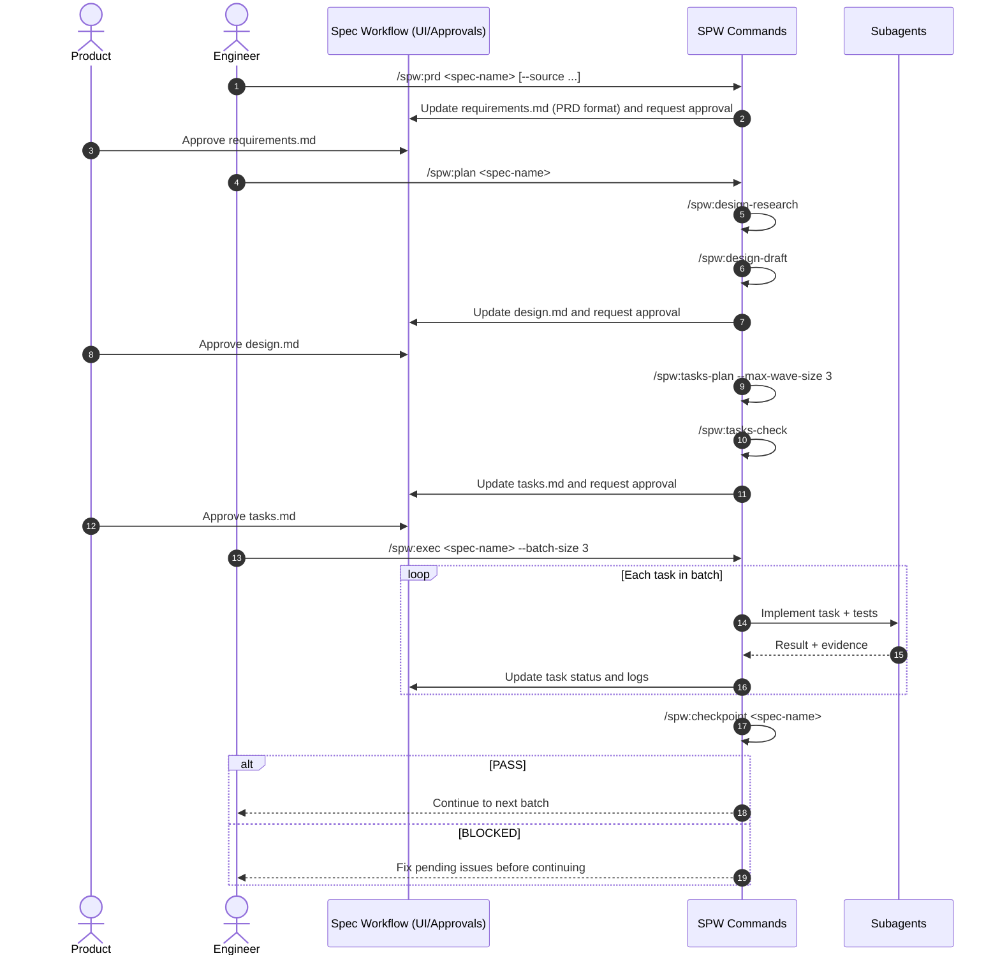

# SPW Workflow (spec-workflow + subagents)

This package implements the discussed model: use `spec-workflow-mcp` as the source of truth (UI + approvals), while adding stricter planning/execution commands for coding agents.

## Goals

- Keep product collaboration in `requirements/design/tasks`.
- Increase technical execution predictability.
- Enforce traceability `requirements -> design -> tasks -> code/tests`.
- Maximize safe parallelism per wave.

## Generated structure

- `spw/commands/spw/design-research.md`
- `spw/commands/spw/design-draft.md`
- `spw/commands/spw/prd.md`
- `spw/commands/spw/tasks-plan.md`
- `spw/commands/spw/tasks-check.md`
- `spw/commands/spw/plan.md`
- `spw/commands/spw/exec.md`
- `spw/commands/spw/checkpoint.md`
- `spw/templates/user-templates/prd-template.md`
- `spw/templates/user-templates/requirements-template.md`
- `spw/templates/user-templates/design-template.md`
- `spw/templates/user-templates/tasks-template.md`
- `spw/templates/user-templates/variants/tasks-template.tdd-on.md`
- `spw/templates/user-templates/variants/tasks-template.tdd-off.md`
- `spw/config/spw-config.toml`
- `spw/hooks/session-start-sync-tasks-template.sh`
- `spw/hooks/README.md`

## How to use templates

Copy templates into the project using spec-workflow:

- `spw/templates/user-templates/requirements-template.md` -> `.spec-workflow/user-templates/requirements-template.md`
- `spw/templates/user-templates/prd-template.md` -> `.spec-workflow/user-templates/prd-template.md`
- `spw/templates/user-templates/design-template.md` -> `.spec-workflow/user-templates/design-template.md`
- `spw/templates/user-templates/tasks-template.md` -> `.spec-workflow/user-templates/tasks-template.md`

Note: in spec-workflow, a custom template in `user-templates/` fully overrides the matching default template.

## Config and hook (TDD via config)

- Configure `.spec-workflow/spw-config.toml`:
  - `execution.tdd_default = false|true`
  - `templates.tasks_template_mode = auto|on|off`
- SessionStart hook auto-syncs:
  - source: `.spec-workflow/user-templates/variants/tasks-template.tdd-*.md`
  - target: `.spec-workflow/user-templates/tasks-template.md`
- With this setup, you do not need a TDD flag in command calls; behavior comes from project config.

## Commands and roles

### 1) `spw:prd`
Generates `requirements.md` in PRD format (more product-oriented), with guided discovery and MCP-source gate when external input is provided (`--source`).
Use when starting from zero (no approved requirements).

### 2) `spw:design-research`
Technical research (codebase + web + Elixir/Phoenix/Ecto/OTP guardrails) and outputs `DESIGN-RESEARCH.md`.

### 3) `spw:design-draft`
Consolidates `requirements + research` into `design.md` with REQ-ID traceability matrix.

### 4) `spw:tasks-plan`
Generates `tasks.md` with:
- explicit dependencies
- wave-based parallelism
- per-task tests (or justified exception)

### 5) `spw:tasks-check`
Validates `tasks.md` consistency (traceability, cycles, wave conflicts, tests).

### 6) `spw:plan`
Orchestrates full pipeline:
`design-research -> design-draft -> tasks-plan -> tasks-check`.
Use when `requirements.md` already exists for the spec.
Before starting, it validates requirements approval via MCP (`spec-status`) and requests approval (`request-approval`) when needed.

## Quick command selection

- Without `requirements.md`: use `spw:prd`.
- With `requirements.md`: use `spw:plan` (it validates/requests MCP approval before continuing).
- Separation rule: `spw:prd` defines requirements; `spw:plan` turns requirements into design/tasks.
- `spw:plan` does not trust file existence alone: it enforces an MCP approval gate first.

### 7) `spw:exec`
Executes `tasks.md` in batches with mandatory checkpoints.

### 8) `spw:checkpoint`
Quality gate between batches/waves with PASS/BLOCKED output.

## Recommended usage sequence

## Operating model (summary)

1. Product approves artifacts in spec-workflow.
2. Technical planning produces traceable design and tasks.
3. Execution runs in batches with subagents and mandatory checkpoints.
4. No wave advances when checkpoint is BLOCKED.

## Next steps

- Adapt commands to your exact runtime format (Claude Code/Codex/OpenCode).
- Tune `max_tasks_per_wave` (3 or 4) based on project risk profile.
- Add an automated per-wave file-conflict check in the pipeline (I can add this next).
