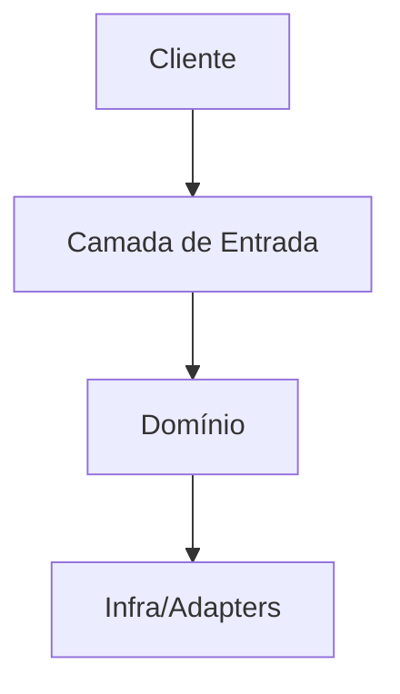

# Design Document

## Overview
- Objetivo técnico da solução:
- Relação com o problema de produto:

## Requirement Mapping (Obrigatório)
| Requirement | Decisão Técnica | Componentes/Arquivos | Estratégia de Teste |
|-------------|------------------|----------------------|---------------------|
| REQ-001 | | | |
| REQ-002 | | | |

## Opções Consideradas e Trade-offs
### Opção A (recomendada)
- Prós:
- Contras:
- Quando não usar:

### Opção B
- Prós:
- Contras:

## Alinhamento com Steering Docs
### tech.md
- Padrões aplicados:

### structure.md
- Convenções de organização aplicadas:

## Reuso de Código
- Módulos/arquivos a reaproveitar:
- Extensões planejadas:
- Código que deve ser evitado/legado crítico:

## Arquitetura
### Boundaries
- Contextos/módulos:
- Dependências permitidas entre módulos:

### Fluxo principal

## Contratos e Modelos de Dados
- Entidades e campos relevantes:
- Contratos de API/eventos:
- Migrações/esquema (se aplicável):

## Estratégia de Erros
- Erros esperados e handling:
- Erros inesperados e fallback:
- Observabilidade (logs/metrics/traces):

## Estratégia de Testes
### Unit
- 

### Integration
- 

### E2E/UAT
- 

## Guardrails Elixir/Phoenix/Ecto/OTP (quando aplicável)
- Phoenix: evitar query em `mount`; carregar dados em `handle_params`.
- Ecto: manter boundaries de contextos; sem acoplamento indevido entre contexts.
- OTP: não criar GenServer sem razão de runtime (estado concorrência/falha).

## Riscos e Mitigações
- Risco:
- Mitigação:
